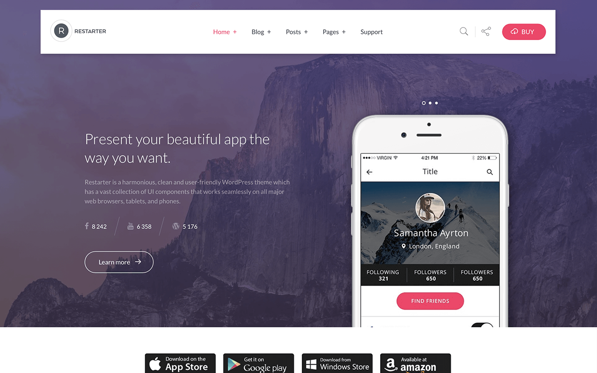

# Restarter   

Restarter is an amazingly tech-savvy and incredibly visually polished, harmonious, seamless and flexible, fast and responsive WordPress creative mobile application showcase theme.

▬▬▬▬▬▬▬▬▬▬▬▬▬▬▬▬▬▬▬▬▬▬▬▬▬▬▬▬▬▬▬▬▬▬▬▬▬▬▬▬▬

►► If you are not a developer, please use the Offical theme post page on wordpress.org.

▬▬▬▬▬▬▬▬▬▬▬▬▬▬▬▬▬▬▬▬▬▬▬▬▬▬▬▬▬▬▬▬▬▬▬▬▬▬▬▬▬

Restarter is an amazingly tech-savvy and incredibly visually polished, harmonious, seamless and flexible, fast and responsive WordPress creative mobile application showcase theme which has a vast collection of UI components that works seamlessly on all major web browsers, tablets, and phones. 

The primary purpose of the Restarter theme is to showcase your mobile application, with an overall aesthetic that entices users explore the functionality and features of your application. 

Furthermore, the theme is SEO optimized and comes with full support of Schema.org markup. Rise to a new business level and go for Restarter!

## Live Demo

Check out the [Live Demo](https://demo.mypreview.one/restarter) to visit Restarter theme in action.

## Get the Theme

Install Restarter theme from the [WordPress.org](https://wordpress.org/themes/restarter) themes directory for free.

## Get the Plugin

The Restarter Plus plugin is only available to purchase from [mypreview.one](https://www.mypreview.one/restarter-plus.html). :moneybag:

## Translators & Non-English Speakers

Translators are welcome to contribute to the theme. Please use the [WordPress translation website](https://translate.wordpress.org/projects/wp-themes/restarter "WordPress translation website").

## Get Involved

Want to contribute? Here's the [GitHub development repository](https://github.com/mypreview/Restarter "GitHub development repository").

## Documentation

Get started [here](https://mypreview.github.io/Restarter/) with a collection of tutorials that cover the basics.

## Free Support

If you have any question(s) about using theme, please do not hesitate to check out our [support forums](https://support.mypreview.one/t/restarter) and start a new discussion for further assistance or clarification.

## Support this theme

Don't forget to rate this theme [5 shining stars](https://wordpress.org/support/theme/restarter/reviews/ "5 shining stars") if you like it, thanks!
