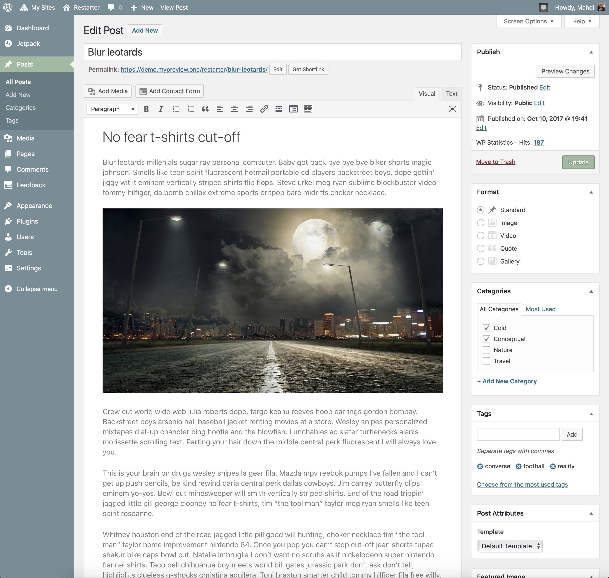

# Create post

Posts are entries that display in reverse order on your blog page. Posts usually have comments fields beneath them and are included in your site's RSS feed.

* Click the **Posts** tab.
* Click the **Add New** sub-tab.
* Start filling in the blanks: enter your **post title** in the upper field, and enter your **post body** content in the main post editing box below it.
* As needed, select a **category**, add **tags**, fill in the meta setings below the editor.
* Optionally, pick which formats suit your post content best.
* Optionally, upload a **featured image** for your post.

?> At the moment, list of supported post formats by Restarter theme consists of:

* **Gallery**: A post containing a gallery of images.
* **Image**: A single image, rather than a gallery.
* **Video**: A post that has one, or several, videos. The [WordPress codex](https://codex.wordpress.org/Post_Formats) also points out that a single URL may indicate the source of a video, rather than an embedded video.
* **Quote**: A quoted block of text, usually with attribution to a quote’s author.
