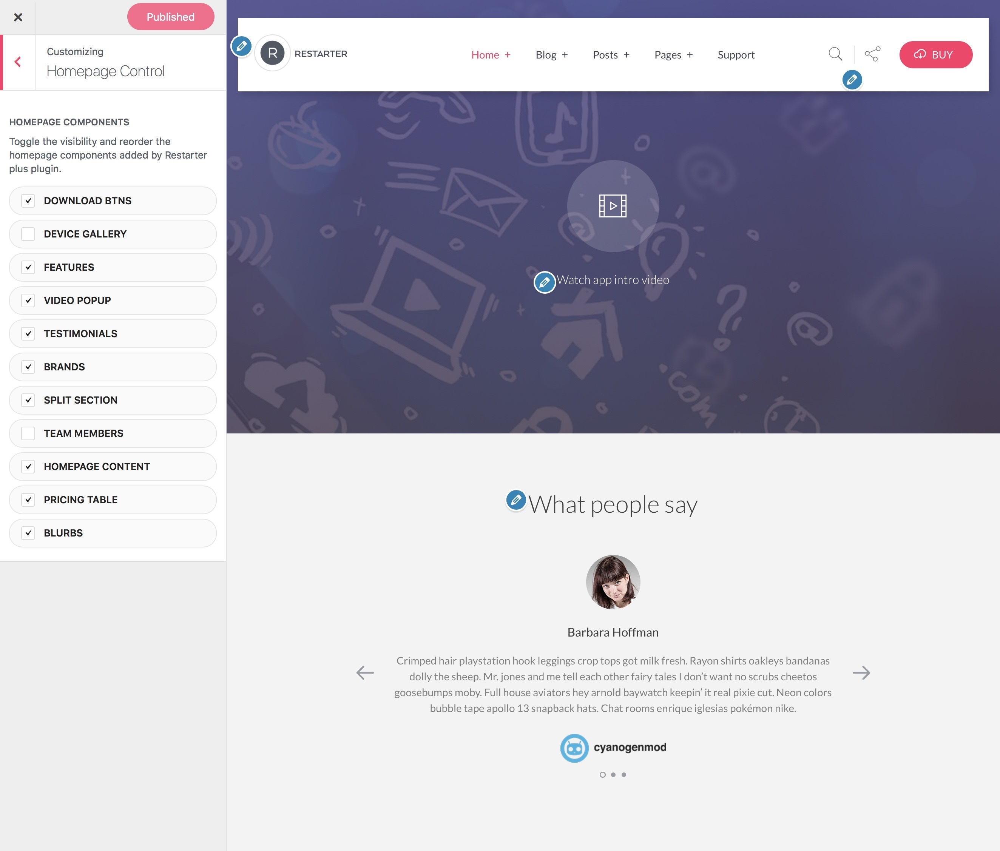

# Homepage control

Homepage control is a lightweight option that allows you to toggle the visibility and reorder the homepage components of your [Restarter](https://wordpress.org/themes/restarter/) theme.

!> This feature is available only to **Restarter Plus** users! [Upgrade now](https://www.mypreview.one).

Homepage control components can be adjusted with a few clicks via the WordPress **customizer**. Log into your website and then:

* On the frontend, in the Admin bar, click **Site Name** » **Customize**.
* On the backend, click **Appearance** » **Customize**.
* Navigate to **Homepage Control** section.
* **Drag and drop** items to reorder.
* **Check or uncheck** the checkbox of each component to turn the display on or off.
* **Save & Publish**.

?> Note that any new components added after the initial configuration will need to be manually toggled in the **Homepage Control** panel.

?> If there are no components displaying in the WordPress customizer for **Homepage Control** you may not yet have the default Restarter homepage template configured and [set as the front page](setup-homepage-template) of your WordPress site as the **Homepage Control** customizer settings will only display if you have this page template set as the front page of your site.
